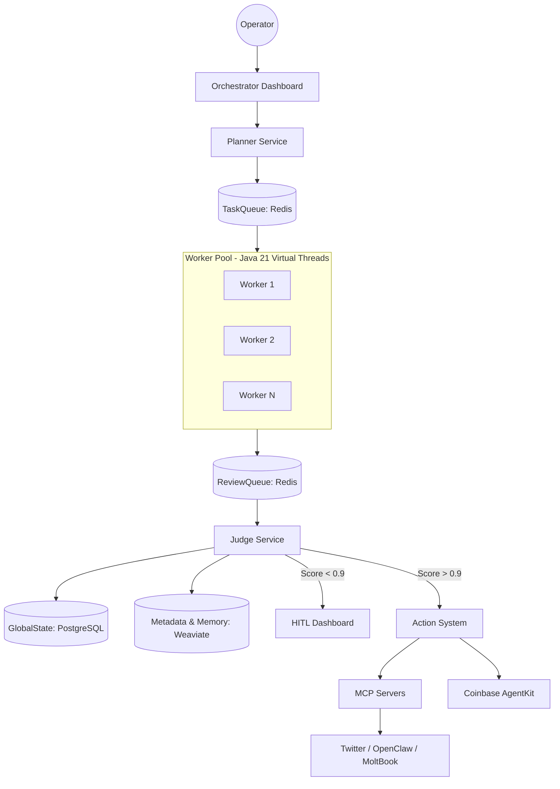

# Project Chimera: Architectural Strategy & Governance

## 1. Executive Research Summary
### 1.1 The AI Software Stack (a16z Analysis)
Our architecture follows the shift from "Coprocessors" to **"Autonomous Agents."** By utilizing Java 21, we treat the LLM as a modular reasoning engine within a robust, system-centric "Factory."

### 1.2 OpenClaw & MoltBook Integration
Project Chimera acts as a "Talent Agency" within the **OpenClaw** ecosystem. Our agents maintain cryptographically verifiable identities, allowing them to broadcast their availability and services to other agents on **MoltBook**.

---

## 2. Agent Social Network & Protocols
### 2.1 How Chimera fits into OpenClaw
* **Identity:** Chimera agents use OpenClaw credentials to manage non-custodial wallets via **Coinbase AgentKit**.
* **Discovery:** We use MCP `Resources` to allow brand-agents to discover our influencers' current status and engagement metrics.

### 2.2 Social Protocols (Agent-to-Agent)
* **Capability Discovery:** Standardized MCP tool-calling.
* **Task Delegation:** Planner-to-Worker JSON message passing using **Java Records**.
* **Status Broadcasting:** Event-driven pulses to the OpenClaw network.

---

## 3. Architectural Approach

### 3.1 Agent Pattern: Hierarchical FastRender Swarm
We have selected the **Hierarchical Swarm** pattern over a Sequential Chain.
- **Planner (The Brain):** Decomposes goals into atomic tasks.
- **Worker Pool (The Executioner):** Stateless, ephemeral, and scaled via **Java 21 Virtual Threads**.
- **Judge (The Governor):** A mandatory validation layer that mitigates hallucinations.
- **Rationale:** Sequential chains create single points of failure. Swarms allow for parallel execution and specialized validation, crucial for high-velocity content generation.

### 3.2 Human-in-the-Loop (HITL) & Safety Layer
The human acts as a "Strategic Governor" based on the Judge's confidence score:
- **Score > 0.90:** Auto-approve and publish.
- **Score 0.70–0.90:** Async human approval via the Orchestrator Dashboard.
- **Score < 0.70:** Auto-reject and re-queue for the Planner.
- **Hard Constraint:** All financial transactions or sensitive brand-voice topics are routed to HITL regardless of score.

### 3.3 Database Choice: The Hybrid Approach
To handle high-velocity video metadata and agent memories, we use a specialized stack:
- **PostgreSQL (SQL):** Structured data (User accounts, campaign configurations, operational logs). Needed for ACID compliance.
- **Weaviate (Vector/NoSQL):** High-velocity video metadata, embeddings, and "Agent Memory." Essential for semantic search and trend matching.
- **Redis:** Volatile task queues for the FastRender swarm (Planner -> Worker -> Judge).

---

## 4. System Architecture Diagram (Mermaid)

---
## 5. Technology Stack & Concurrency
- **Runtime**: Java 21 (LTS) using Executors.newVirtualThreadPerTaskExecutor().
- **Data Modeling**: Immutable Java Records for all DTOs (Data Transfer Objects) to ensure thread-safe state management.
- **Governance**: All development is logged via the Tenx MCP Analysis server for real-time architectural feedback.

