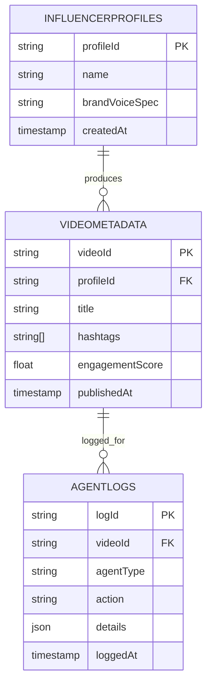

# Technical Specifications

## 1. API Contracts

### TaskRequest
The TaskRequest is a JSON message sent from the Planner Agent to Worker Agents in the swarm. It encapsulates the task details in an immutable structure.

```json
{
  "$schema": "https://json-schema.org/draft/2020-12/schema",
  "type": "object",
  "properties": {
    "taskId": {
      "type": "string",
      "description": "Unique identifier for the task"
    },
    "description": {
      "type": "string",
      "description": "Human-readable description of the task"
    },
    "priority": {
      "type": "integer",
      "minimum": 1,
      "maximum": 10,
      "description": "Priority level (1=low, 10=high)"
    },
    "inputData": {
      "type": "object",
      "description": "Immutable input data required for task execution"
    },
    "deadline": {
      "type": "string",
      "format": "date-time",
      "description": "ISO 8601 timestamp for task deadline"
    },
    "correlationId": {
        "type": "string",
        "description": "Unique UUID to trace the request across Planner, Worker, and Judge."
    }
  },
  "required": ["taskId", "description", "priority"]
}
```

### Java Record Implementation (Executable Spec)

To demonstrate executable specifications, here's the Java Record implementation corresponding to the TaskRequest schema:

```java
import java.time.LocalDateTime;
import java.util.Map;

public record TaskRequest(
    String taskId,
    String description,
    int priority,
    Map<String, Object> inputData,
    LocalDateTime deadline,
    String correlationId
) {
    // Immutable by design - no setters, all fields final
}
```

### ValidationResult
The ValidationResult is a JSON response from the Judge Agent, containing the validation outcome for generated content.

```json
{
  "$schema": "https://json-schema.org/draft/2020-12/schema",
  "type": "object",
  "properties": {
    "contentId": {
      "type": "string",
      "description": "Unique identifier of the validated content"
    },
    "score": {
      "type": "number",
      "minimum": 0.0,
      "maximum": 1.0,
      "description": "Confidence score (0.0=reject, 1.0=perfect)"
    },
    "approved": {
      "type": "boolean",
      "description": "Whether the content is approved for publication"
    },
    "feedback": {
      "type": "string",
      "description": "Optional feedback for content improvement"
    },
    "validatedAt": {
      "type": "string",
      "format": "date-time",
      "description": "Timestamp of validation"
    },
    "correlationId": {
        "type": "string",
        "description": "Unique UUID to trace the request across Planner, Worker, and Judge."
    }
  },
  "required": ["contentId", "score", "approved"]
}
```

## 2. Database Schema

The following Mermaid ERD illustrates the relationships between key entities in the PostgreSQL database:



## 3. Hybrid Storage

### Weaviate Class Schema

For handling high-velocity video metadata and semantic agent memory, Project Chimera uses Weaviate as a vector database to enable fast semantic search and embedding-based retrieval.

**VideoMetadata Class:**
```graphql
{
  "class": "VideoMetadata",
  "description": "Stores video content metadata with vector embeddings for semantic search",
  "properties": [
    {
      "name": "title",
      "dataType": ["string"],
      "description": "Video title"
    },
    {
      "name": "hashtags",
      "dataType": ["string[]"],
      "description": "Associated hashtags"
    },
    {
      "name": "engagementScore",
      "dataType": ["number"],
      "description": "Calculated engagement score"
    },
    {
      "name": "embeddings",
      "dataType": ["number[]"],
      "description": "Vector embeddings for semantic search"
    },
    {
      "name": "profileId",
      "dataType": ["string"],
      "description": "Reference to influencer profile"
    }
  ],
  "vectorizer": "text2vec-transformers"
}
```

**AgentMemory Class:**
```graphql
{
  "class": "AgentMemory",
  "description": "Semantic memory storage for agent experiences and learning",
  "properties": [
    {
      "name": "agentId",
      "dataType": ["string"],
      "description": "Agent identifier"
    },
    {
      "name": "experience",
      "dataType": ["string"],
      "description": "Text description of agent experience"
    },
    {
      "name": "outcome",
      "dataType": ["string"],
      "description": "Result or lesson learned"
    },
    {
      "name": "embeddings",
      "dataType": ["number[]"],
      "description": "Vector embeddings for memory retrieval"
    },
    {
      "name": "timestamp",
      "dataType": ["date"],
      "description": "When the memory was recorded"
    }
  ],
  "vectorizer": "text2vec-transformers"
}
```

## 4. Concurrency Model

Project Chimera leverages Java 21's Virtual Threads for efficient handling of I/O-bound tasks in the FastRender Swarm pattern. Virtual Threads are lightweight, user-mode threads that allow the JVM to scale concurrent operations without the overhead of traditional platform threads.

### Key Implementation Details:
- **Executor Service**: Use `Executors.newVirtualThreadPerTaskExecutor()` to create a pool of virtual threads for I/O operations.
- **I/O Bound Tasks**: Virtual threads are ideal for tasks involving network calls (e.g., MCP tool invocations, Twitter API fetches), database queries, and file I/O, as they can park efficiently during blocking operations.
- **Swarm Execution**: Each Worker Agent runs on a virtual thread, allowing thousands of concurrent workers without exhausting system resources.
- **Immutability**: Combined with immutable state (Java Records), virtual threads ensure thread-safe execution and simplify debugging.
- **Blocking vs. Non-Blocking**: Virtual threads automatically handle blocking I/O by yielding control back to the scheduler, enabling high concurrency without complex async programming.
- **Optimistic Concurrency Control (OCC)**: Implement OCC strategies using version numbers or timestamps in immutable records to detect and resolve conflicts during state transitions, ensuring thread-safety without traditional locking mechanisms.